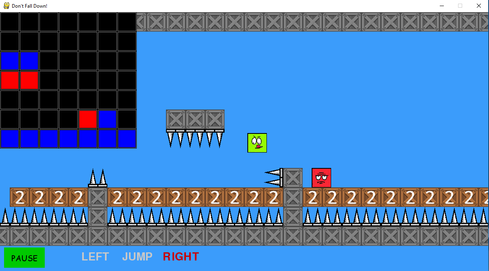
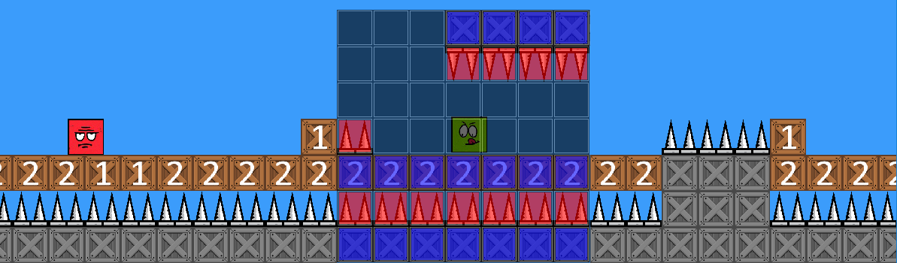

# Don't Fall Down With Evolutionary Algorithms
DFD - Don't Fall Down! Platformer game developed with Python Pygame

Goal - Train player bot to pass the game

## Install and run
To run this game you will need to install python 3 and pygame. To run this game hit

`python main.py`

## Screenshot from the project

## Explenation of the input matrix color visualization from the game

## Source used
* Dont fall down game repo [here](https://github.com/jaroslavsiroic/dontfalldown)
* Evolutionary Algorith and Neural nets classes from [FlapAI repo](https://github.com/justinglibert/flapai)

## Assets:
* [finish flag](https://icons8.com/icon/35528/finish-flag)
* [spikes](https://opengameart.org/content/bevouliin-free-ingame-items-spike-monsters)
* [platformer tileset](https://www.gameart2d.com/free-platformer-game-tileset.html)
* [smiley faces](http://www.free-graphics.com/clipart/Smiley/index3.shtml)

